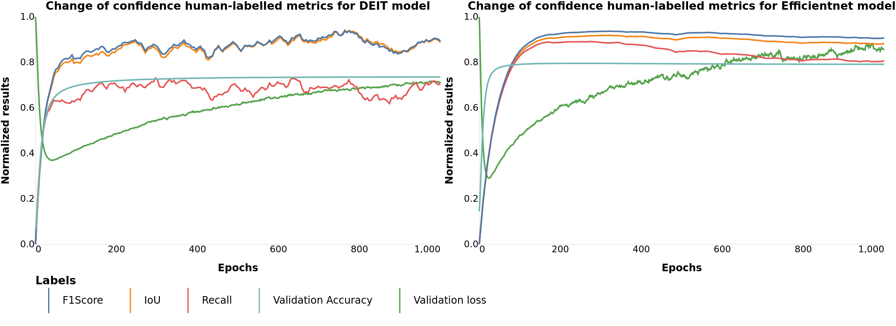

# Explainable AI
This repository contains the framework for model explainability evaluation.

The framework contains different labeled and unlabeled metrics to run on your model to evaluate its explainability and
performance.
It can perform evaluations both after training and after each epoch.

In case you decide to evaluate your model during training, you can choose easy to use
JSON file, with results for different metrics after each epoch.


## Content

1. [Run](#Run)
2. [ Config ](#Config)
2. [ Labeled Metrics ](#Labeled-metrics)
    - [ IoUscore ](#IoUScore)
    - [ Recall ](#Recall)
    - [ Precision ](#Precision)
    - [ F1Score ](#F1Score)
    - [ Mean Absolute Error ](#Mean-Absolute-Error)
        - [ MAE ](#MAE)
        - [ MAEFN ](#MAEFN)
        - [ MAEFP ](#MAEFP)
3. [ Unlabeled metrics ](#Unlabeled-metrics)
4. [ Callbacks ](#Callbacks)
    - [ ModelEvaluationCallback ](#ModelEvaluationCallback)
    - [ ModelImageSaveCallback ](#ModelImageSaveCallback)
    - [ NoLabelCallback ](#NoLabelCallback)

## Run<a name="Run"></a>
- Download datasets from these sites:

PascalVoC (saliency annotated subset) [[2]](#2): https://github.com/SinaMohseni/ML-Interpretability-Evaluation-Benchmark

Gender [[1]](#1):  https://drive.google.com/file/d/1Mt9k5Qfcp4tYqWuq7xWhf76QHLyYPDft/view?usp=sharing

Scene [[1]](#1): https://drive.google.com/file/d/1ULF6UAcg9Yvy3fa50dV8H4I9ZJFAW-SK/view?usp=sharing

- Change paths in the config files to the paths, where you downloaded your datasets

- Run the following script

Pvoc:

```commandline
pip install -r requirements.txt
python trainer.py --config-file pvoc --model mobilenet
```

Gender:

```commandline
pip install -r requirements.txt
python trainer.py --config-file gender --model mobilenet
```

Scene:

```commandline
pip install -r requirements.txt
python trainer.py --config-file scene --model mobilenet
```

The script for training your model will start, the results with weights will be saved in the specified directory:

config.log_dir + '/' config.tasks + '/' + time() directory.

Adversarial training:
```commandline
pip install -r requirements.txt
python adversarial_trainer.py
```
(currently for PascalVoC only, detailed configuration in config\adv_resnet_pvoc_mc.py):
adapted from https://github.com/microsoft/robust-models-transfer


For evaluation only use runner.py script with available models:

```commandline
pip install -r requirements.txt
python runner.py --config-file [pvoc or scene or gender] --model [any available model]
```
available model options:
```
'resnet' - resnet50
'adversarial_resnet50' - resnet50 version that allows adversarial training
'widenet' - equivariant wide resnet version
'mobilenet' - mobilenet-v3
'efficientnet' - efficientNet
'vision16' - Vision Transformer model
'deit' - DEIT transformer model
```

<a name="Labeled metrics"></a>
## Config
   ```
      seed - torch seed for training.
      log_dir - directory for logging(used to get path for metrics saving).
      task - task name(used to get path for metrics saving).
      experiment_name - experiment name.
      device - name of the device to train on.
      gpus - indexes of used GPUs.
      epochs - number of epochs.
      grad_clip_val - gradient clip value.
      backbone_lr - learning rate for the model backbone.
      classifier_lr - learning rate for a model classifier.
      scheduler_gamma - optimizer scheduler gamma(used after each epoch).
      root_path - path to the dataset directory.
      train_resize_size - image size for the training dataset.
      train_crop_size - random cropping after the resize for the training dataset.
      eval_resize_size - image size for evaluation dataset.
      num_workers - number of workers.
      batch_size_per_gpu - batch size per GPU.
      num_classes - size of the last layer(number of different classes).
      last_layer - if True, add a new layer; else, change the last layer of the model.
      criterion - loss function
      accuracy - not explainability metrics to calculate.
      augmentation - augmentation for the training dataset.
      datamodule - datamodule to get train and validation dataset.
      metrics - explainability metrics to calculate.
      final_activation - final activation function.
      dataset_eval - evaluation dataset.
      callbacks - callbacks for explainability evaluation metrics.  
```
For adversarial config file options in config\adv_resnet_pvoc_mc.py see details in
https://robustness.readthedocs.io/en/latest/example_usage/training_lib_part_1.html

## Labeled metrics<a name="Labeled-metrics"></a>


Labelled metrics can be used if you have attention mask ground truth, as they need both prediction and target to
calculate the value.

These metrics are designed to calculate the similarity between human and model attention masks and can be used to prove your
model results.



<a name="IoUScore"></a>
#### IoUScore

Calculate IoUScore between the predicted attention map and ground truth.

This metric can also be used with ModelEvaluationCallback to calculate IoUScore after each training epoch.


```python
from src.metrics.metrics import MetricIoU
import torch

correct = torch.ones((1, 3, 100, 100))
predict = torch.rand((1, 3, 100, 100))
metric = MetricIoU(attn_threshold=0.5)
print(metric(correct, predict))
metric = MetricIoU(attn_threshold=0.2)
print(metric(correct, predict))
```

```python      
tensor(0.5070)
tensor(0.8018)
```

<a name="Recall"></a>

#### Recall

Calculate the Recall between the predicted attention map and ground truth.

This metric can also be used with ModelEvaluationCallback to calculate Recall after each training epoch.


```python
from src.metrics.metrics import MetricRecall
import torch

correct = torch.rand((1, 3, 100, 100))
predict = torch.rand((1, 3, 100, 100))
metric = MetricRecall(attn_threshold=0.5)
print(metric(correct, predict))
metric = MetricRecall(attn_threshold=0.2)
print(metric(correct, predict))
```

```python
tensor(0.4945)
tensor(0.8018)
```

<a name="Precision"></a>

#### Precision

Calculate the Precision between the predicted attention map and ground truth.

This metric can also be used with ModelEvaluationCallback to calculate Precision after each training epoch.


```python
from src.metrics.metrics import MetricPrecision
import torch

correct = torch.rand((3, 100, 100))
predict = torch.rand((3, 100, 100))
metric = MetricPrecision(attn_threshold=0.5)
print(metric(correct, predict))
metric = MetricPrecision(attn_threshold=0.2)
print(metric(correct, predict))
```

```python
tensor(0.4979)
tensor(0.7972)
```

<a name="F1Score"></a>

#### F1Score

Calculate the F1Score between the predicted attention map and ground truth.

This metric can also be used with ModelEvaluationCallback to calculate F1Score after each training epoch.


```python
from src.metrics.metrics import MetricF1Score
import torch

correct = torch.rand((3, 100, 100))
predict = torch.rand((3, 100, 100))
metric = MetricF1Score(attn_threshold=0.5)
print(metric(correct, predict))
metric = MetricF1Score(attn_threshold=0.2)
print(metric(correct, predict))
```

```python
tensor(0.5037)
tensor(0.7998)
```

<a name="Mean-Absolute-Error"></a>

### Mean Absolute Error

<a name="MAE"></a>

#### MAE

Compute mean absolute error between the predicted attention map and ground truth.

This metric can also be used with ModelEvaluationCallback to calculate MAE after each training epoch.


```python
from src.metrics.metrics import MetricMAE
import torch

correct = torch.randint(0, 1, (3, 100, 100))
predict = torch.rand((3, 100, 100))
metric = MetricMAE()
print(metric(correct, predict))

```

```python
tensor(0.5012)
```

<a name="MAEFN"></a>

#### MAEFN

Compute mean absolute error between the predicted attention map and ground truth, but only for indexes where ground
truth is equal to 0.

This metric can also be used with ModelEvaluationCallback to calculate MAEFN after each training epoch.


```python
from src.metrics.metrics import MetricMAEFN
import torch

correct = torch.randint(0, 1, (3, 100, 100))
predict = torch.rand((3, 100, 100))
metric = MetricMAEFN()
print(metric(correct, predict))

```

```python
tensor(0.5001)
```

<a name="MAEFP"></a>

#### MAEFP

Compute mean absolute error between the predicted attention map and ground truth, but only for indexes where ground
truth is **not** equal to 0.

This metric can also be used with ModelEvaluationCallback to calculate MAEFP after each training epoch.


```python
from src.metrics.metrics import MetricMAEFP
import torch

correct = torch.randint(0, 1, (3, 100, 100))
predict = torch.rand((3, 100, 100))
metric = MetricMAE()
print(metric(correct, predict))

```

```python
tensor(0.4998)
```

<a name="Unlabeled metrics"></a>

## Unlabeled metrics

These metrics use unlabeled data to predict model performance.

The main idea of this metric is to calculate the confidence change after removing some percent of the image.

To do this, we are using **https://pypi.org/project/grad-cam/**, and all unlabeled metrics and CAM algorithms are
supported with ModelNoLabelCallback.

You can read more about all these metrics on **https://jacobgil.github.io/pytorch-gradcam-book/introduction.html**


<a name="Callbacks"></a>

## Callbacks

Currently, our framework contains three Callbacks, which can be used after epoch evaluation.
You can easily add these Callbacks to your torch model.

<a name="ModelEvaluationCallback"></a>

### ModelEvaluationCallback

This callback evaluates model performance, which uses labels to calculate scores.
Callback creates a JSON file, where results are saved as a dictionary, with names of metric as key and value as a list of
average
model performance on the evaluation dataset on the specific epoch.

To create this class, you need to set a few arguments:


```
explanator - pytorch-grad-cam CAM algorithm to create an activation map
dataset_eval - the dataset on which your model will be evaluated; it should 
 contain both labels and ground truth activation map.
save_file - the name of the JSON file where results will be saved.
metrics - Metrics, which scores will be calculated,
run_every_x(default 10) - how often do you want to evaluate your model
reshape_transform - transformation in case of using transformer, for example use:
 pytorch_grad_cam.utils.reshape_transforms.vit_reshape_transform 
 in the case of the DEIT model
 ```

#### ModelEvaluationCallback use EvalRunner, which can be used for one time model evaluation.

<a name="ModelImageSaveCallback"></a>

### ModelImageSaveCallback

This callback saves attention maps and image-vice metrics for the eval_dataset given by the explanator.

To create this class, you need to set a few arguments:


```
explanator - pytorch-grad-cam CAM algorithm to create an activation map
dataset_eval - the dataset on which your model will be evaluated; it should 
 contain both labels and ground truth activation map.
save_file - the name of the JSON file where results will be saved.
metrics - Metrics, which scores will be calculated,
run_every_x(default 10) - how often do you want to evaluate your model
reshape_transform - transformation in case of using transformer, for example use:
 pytorch_grad_cam.utils.reshape_transforms.vit_reshape_transform 
 in the case of the DEIT model
 ```

#### ModelImageSaveCallback use SaveRunner, which can be used for one time model evaluation.

<a name="NoLabelCallback"></a>

### NoLabelCallback
This callback calculates no label metrics for eval_dataset given by the explanator.

To create this class, you need to set a few arguments:


```
explanator - pytorch-grad-cam CAM algorithm to create an activation map
dataset_eval - the dataset on which your model will be evaluated; it should 
 contain both labels and ground truth activation map.
save_file - the name of the JSON file where results will be saved.
metrics - Metrics, which scores will be calculated,
run_every_x(default 10) - how often do you want to evaluate your model
reshape_transform - transformation in case of using transformer, for example use:
 pytorch_grad_cam.utils.reshape_transforms.vit_reshape_transform 
 in the case of the DEIT model
```

#### NoLabelCallback use LabelRunner, which can be used for one time model evaluation.

## References

<a id="1">[1]</a> 
RES: A Robust Framework for Guiding Visual Explanation,
Gao, Yuyang and Sun, Tong Steven and Bai, Guangji and Gu, Siyi and Hong, Sungsoo Ray and Zhao, Liang. 
Proceedings of the 28th ACM SIGKDD International Conference on Knowledge Discovery and Data Mining,
August 2022,ACM 

<a id="2">[2]</a>
@Quantitative Evaluation of Machine Learning Explanations: A Human-Grounded Benchmark, 
Mohseni, Sina and Block, Jeremy E and Ragan, Eric D, arXiv preprint arXiv:1801.05075, 2020
